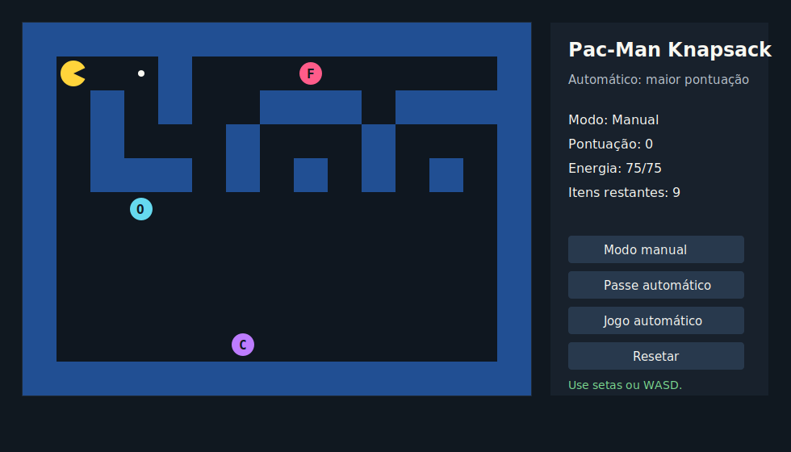
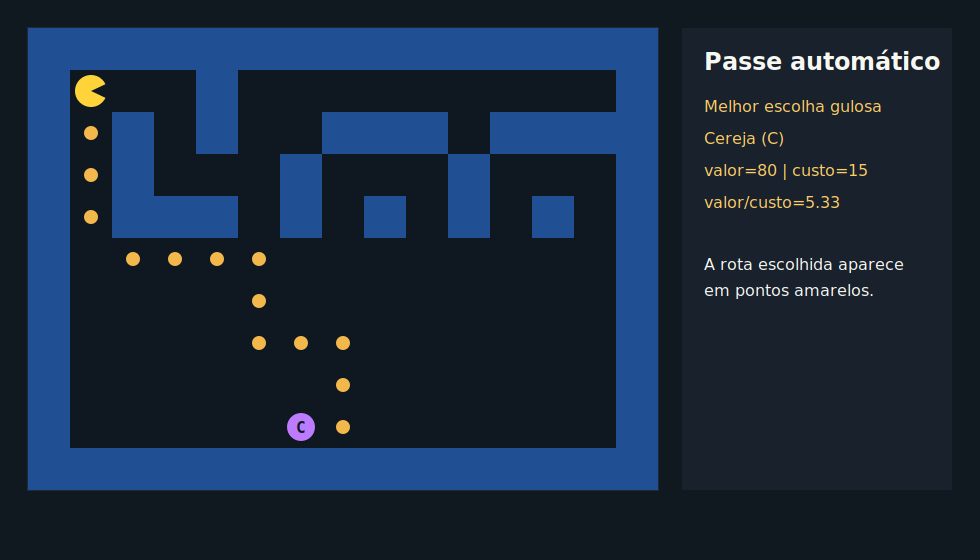
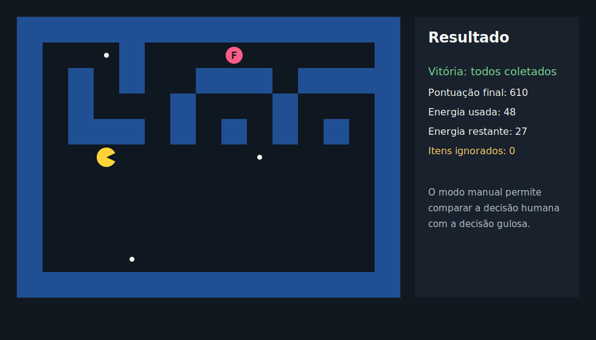

# Greed_G3_Pac-Man

**Conteúdo da Disciplina**: Algoritmos Ambiciosos

## Alunos
|Matrícula | Aluno |
| -- | -- |
| 20/0035703  |  Breno Alexandre Soares Garcia |
| 22/1008033  |  Fernando Gabriel Dos Santos Carrijo |

## Sobre
O projeto **Greed_G3_Pac-Man** é uma simulação com interface gráfica inspirada no Pac-Man, adaptada para aplicar uma estratégia gulosa baseada no problema da **Mochila (Knapsack)**.

No jogo, o Pac-Man possui uma quantidade limitada de energia e precisa decidir quais itens coletar no mapa. Cada item possui uma pontuação, e o custo para coletá-lo é calculado pela distância mínima entre a posição atual do jogador e a posição do item. A escolha gulosa prioriza o item com a melhor relação entre pontuação e custo.

O projeto possui dois modos de uso:
* **Modo manual:** o jogador controla o Pac-Man com as setas ou teclas WASD.
* **Modo automático:** o algoritmo guloso escolhe os itens com maior razão `valor / custo`.

A energia inicial foi balanceada para `75`, permitindo que o modo automático consiga coletar todos os itens do mapa, mas sem sobrar energia demais.

Na modelagem do problema:
* **Jogador:** representa o Pac-Man, indicado por `P`.
* **Mapa:** representa o ambiente navegável em formato de grid.
* **Paredes:** bloqueiam a movimentação, indicadas por `#`.
* **Itens:** representam pontos, frutas, power-ups e cerejas.
* **Valor:** representa a pontuação obtida ao coletar um item.
* **Custo:** representa a energia gasta para chegar até o item.
* **Capacidade:** representa a energia total disponível para o Pac-Man.

## Técnica Utilizada
**Knapsack com estratégia gulosa**

O algoritmo avalia todos os itens ainda disponíveis e calcula, para cada um, a razão:

```text
valor / custo
```

Em seguida, seleciona o item com a maior razão, desde que o custo caiba na energia restante. Após cada coleta, a posição do Pac-Man, a pontuação e a energia restante são atualizadas. O processo continua até que não exista mais nenhum item alcançável dentro da energia disponível.

Embora o custo seja obtido a partir de caminhos no grid, o foco do trabalho é a decisão gulosa: escolher o item mais vantajoso localmente para maximizar a pontuação dentro de uma capacidade limitada.

## Itens do Mapa
| Símbolo | Item | Pontuação |
| -- | -- | -- |
| `.` | Ponto comum | 10 |
| `O` | Power-up | 30 |
| `F` | Fruta | 50 |
| `C` | Cereja | 80 |

## Funcionalidades
* Representação do mapa em interface gráfica.
* Energia limitada para o jogador.
* Cálculo do custo de deslocamento até cada item.
* Seleção gulosa por maior razão `valor / custo`.
* Atualização da pontuação e da energia após cada coleta.
* Exibição da rota escolhida em cada rodada com `*`.
* Relatório final com itens coletados, itens ignorados, energia usada e pontuação total.
* Testes unitários para validação da lógica principal.
* Interface gráfica com mapa colorido, painel de status e controles de execução.
* Modo manual controlado por setas ou WASD.
* Modo automático com execução por passe ou contínua.

## Vídeo

Segue o vídeo feito pela dupla: [Link](Link)

## Screenshots


> *Figura 1: Execução inicial com mapa, Pac-Man e itens coletáveis.*


> *Figura 2: Rodada da simulação mostrando a rota escolhida pela estratégia gulosa.*


> *Figura 3: Resultado final com pontuação, energia restante e itens ignorados.*

## Instalação
**Linguagem**: `Python 3.8+`<br>
**Framework**: `Nenhum (Terminal)`<br>

**Pré-requisitos:**
É necessário ter o Python instalado na máquina. O projeto não utiliza bibliotecas externas.

**Passo a passo da instalação:**

1. Clone este repositório:
```bash
git clone https://github.com/projeto-de-algoritmos-2026/Greed_G3_Pac-Man
```

2. Acesse a pasta do projeto:
```bash
cd Greed_G3_Pac-Man
```

3. Execute o projeto:
```bash
python main.py
```

## Uso
Ao executar o projeto, a simulação mostra o mapa inicial e inicia as rodadas de coleta.

Em cada rodada, o algoritmo:
* Calcula o custo para alcançar cada item disponível.
* Soma o valor dos itens encontrados na rota até o destino.
* Calcula a razão `valor / custo` da rota.
* Escolhe o item com melhor custo-benefício.
* Move o Pac-Man até o item.
* Coleta todos os itens encontrados no caminho.
* Atualiza energia e pontuação.

Exemplo de execução:

```bash
python main.py
```

Para executar os testes:

```bash
python -m unittest discover
```

## Estrutura do Projeto
```text
.
├── main.py
├── src
│   ├── game.py
│   ├── greedy.py
│   ├── grid.py
│   ├── maps.py
│   └── models.py
└── tests
    └── test_greedy.py
```